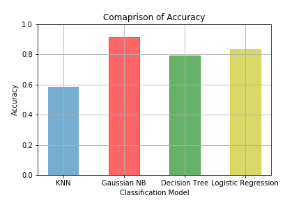
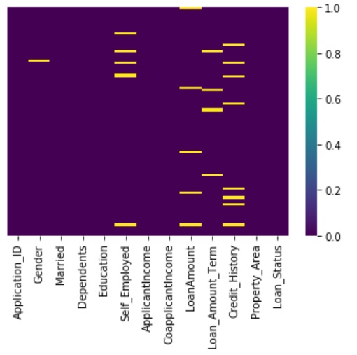
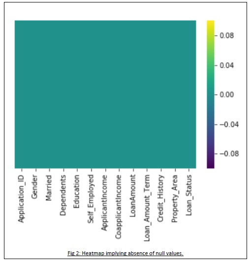

# Prediction of Loan Application Status

[](LICENSE)


We trained 4 models viz. *‘KNN classifier model’, ‘Naive Bayes classifier model’, ‘Decision Tree classifier model’ and ‘Linear Regression classifier model’* for binary classification based on the attributes present in the dataset and predict whether a loan application should be approved or not.

<table style="width:100%">
  <tr>
    <th>Accuracy Comparisons</th>
    <th>Data with Null values</th>
    <th>Data after processing Null values</th>
  </tr>
  <tr>
    <td></td>
    <td></td>
    <td></td>
  </tr>
</table>

## About
- In this project we have a shortened ‘Predict Loan Application Status’ Dataset from Kaggle. 
- In this dataset, the target attribute is the loan status which is in binary. So, we did a binary classification based on the attributes present in our dataset and predicted whether a loan application should be approved or not. 
- We found out the score, classification report, plotted the Receiver Operating Characteristic graph and found out the Area Under Curve (AUC) for each of the models trained. 
- We used the trained models to predict the outcomes using the given test dataset and compare the outcome of each model. 
- We choose the best model based on the accuracy score and classification report.
- Detailed report is in the pdf file located [here](https://github.com/the-it-weirdo/LoanApplicationStatusPrediction-ML/tree/master/Project%20Report%20and%20PowerPoint%20Presentation).

## Built With 🛠
- [Python](https://www.python.org/) - Python is an interpreted, object-oriented, high-level programming language with dynamic semantics
- [NumPy](https://numpy.org/) - The fundamental package for scientific computing with Python
- [SciPy](https://www.scipy.org/) - SciPy (pronounced “Sigh Pie”) is a Python-based ecosystem of open-source software for mathematics, science, and engineering
- [pandas](https://pandas.pydata.org/) - pandas is a fast, powerful, flexible and easy to use open source data analysis and manipulation tool,
built on top of the Python programming language.
- [matplotlib](https://matplotlib.org/) - Matplotlib is a comprehensive library for creating static, animated, and interactive visualizations in Python.
- [seaborn](https://seaborn.pydata.org/) - Seaborn is a Python data visualization library based on matplotlib.


## Contributors
- [Debaleen Das Spandan](https://github.com/the-it-weirdo)
- [Shouvit Pradhan](https://github.com/shaw8wit)
   

## License
```
MIT License

Copyright (c) 2020 Debaleen Das Spandan and Shouvit Pradhan

Permission is hereby granted, free of charge, to any person obtaining a copy
of this software and associated documentation files (the "Software"), to deal
in the Software without restriction, including without limitation the rights
to use, copy, modify, merge, publish, distribute, sublicense, and/or sell
copies of the Software, and to permit persons to whom the Software is
furnished to do so, subject to the following conditions:

The above copyright notice and this permission notice shall be included in all
copies or substantial portions of the Software.

THE SOFTWARE IS PROVIDED "AS IS", WITHOUT WARRANTY OF ANY KIND, EXPRESS OR
IMPLIED, INCLUDING BUT NOT LIMITED TO THE WARRANTIES OF MERCHANTABILITY,
FITNESS FOR A PARTICULAR PURPOSE AND NONINFRINGEMENT. IN NO EVENT SHALL THE
AUTHORS OR COPYRIGHT HOLDERS BE LIABLE FOR ANY CLAIM, DAMAGES OR OTHER
LIABILITY, WHETHER IN AN ACTION OF CONTRACT, TORT OR OTHERWISE, ARISING FROM,
OUT OF OR IN CONNECTION WITH THE SOFTWARE OR THE USE OR OTHER DEALINGS IN THE
SOFTWARE.
```